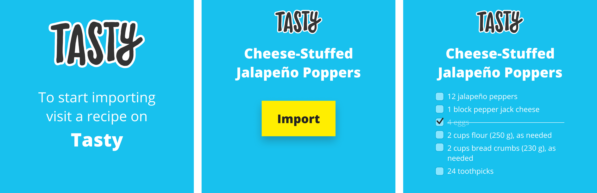

<h1 align="center">
    
</h1>
<h4 align="center">You can read the written tutorial about the implementation on <strong><a href="https://www.webtips.dev/how-to-make-your-very-first-chrome-extension">webtips.dev</a></strong> 🌶️</h4>
